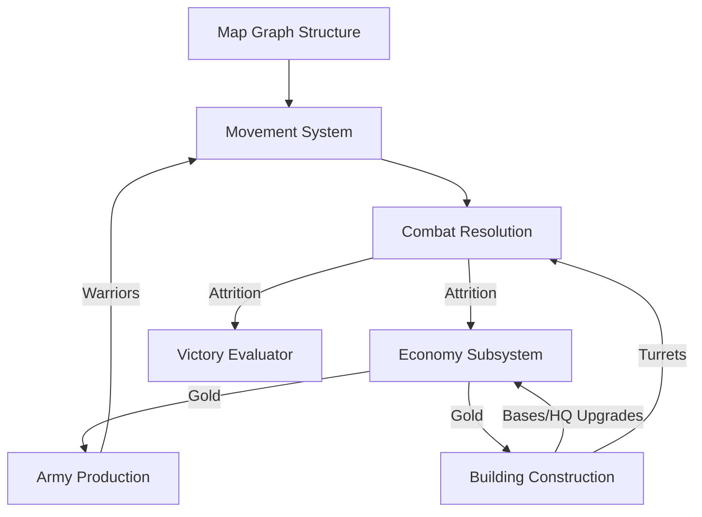
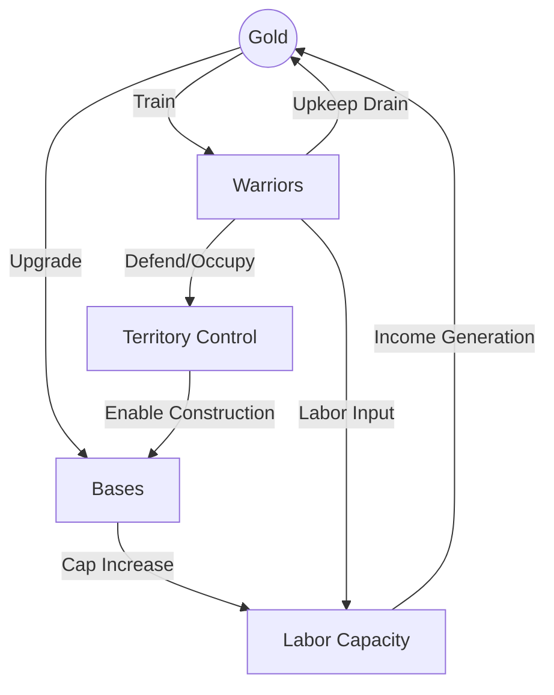

# NEXT NATION: Game Theory and Dynamic Systems Analysis

This research document analyzes the turn-based strategy game **NEXT NATION** from the perspective of dynamic systems, control theory, and game theory. Rather than summarizing the engine specifications, this paper seeks to establish the mathematical and strategic principles that dictate competitive victory.

---

## Chapter 1 — System Decomposition

We decompose **NEXT NATION** into eight interacting subsystems. The state of the game at any turn $t$ is the manifestation of these coupled dynamics.



### 1.1 The Subsystems
1. **Map (Topology & Adjacency)**: A static, point-symmetric graph $G = (V, E)$ defining path distances and the spatial configuration of strategic choke points and Strongholds.
2. **Economy (Gold & Resource Allocation)**: A resource generator and drain system governed by building levels, worker allocation, and warrior maintenance costs.
3. **Army (Military Presence)**: A collection of mobile, homogeneous agents possessing unique IDs, spatial positions, and discrete HP values.
4. **Buildings (Territorial Anchor Points)**: Fixed structures providing defensive fire, economic amplification, and spawning capabilities.
5. **Movement (Spatial Flow)**: A vector-field-like flow of warriors traversing edges. It is subject to path blocking when intersecting enemy nodes.
6. **Combat (Attrition Engine)**: A deterministic, simultaneous damage-resolution mechanism that reduces army and building health.
7. **Time (Turn Horizon)**: A finite boundary $t \in [1, 200]$ that decays utility values of long-term investments as $t$ approaches 200.
8. **Victory (Objective Function)**: The terminal evaluator calculating HQ health at $t = 200$ or when $\text{HQ}_{\text{HP}} = 0$.

### 1.2 The Core Dependency Chain
A naive model assumes a linear dependency chain:
$$\text{Economy} \to \text{Army Production} \to \text{Territorial Control} \to \text{Economic Domination} \to \text{Victory}$$

However, this linear model is **incomplete** because it fails to capture **attrition** and **turn-boundary decay**. The true system is a closed-loop feedback system with a decaying horizon:

$$\text{Net Gold Rate } (\Delta G) = \text{Income}(W_e, B) - \text{Upkeep}(W_t)$$
$$\text{Army Growth Rate } (\Delta W) = \text{Training}(G) - \text{Combat Losses}(Combat(W, B_{turret}))$$

**Conclusion**: Territorial control is not merely a path to economic advantage; it is a tactical buffer. If army production is prioritized at the expense of economic maintenance, the system undergoes a sudden transition into **economic collapse**, which immediately triggers **military collapse** due to unpaid upkeep.

---

## Chapter 2 — The Mathematics of Winning

Competitive programming often confuses resource maximization with winning. In **NEXT NATION**, we must mathematically define the winning state.

### 2.1 The Objective Function
The game objective is to maximize the margin of HQ Health at the terminal turn $T_{end}$ (where $T_{end} \le 200$):
$$\text{Maximize } \Phi = \text{HP}_{\text{HQ\_self}}(T_{end}) - \text{HP}_{\text{HQ\_opp}}(T_{end})$$
Subject to:
$$\text{HP}_{\text{HQ\_self}}(t) > 0 \quad \forall t \in [1, T_{end}]$$

### 2.2 Winning State vs. Proxy States
We distinguish the **terminal winning state** from **intermediate proxy states**:

* **Proxy State A: Max Income ($I$)**: A state where our income is maximized. 
  * *Verdict*: **Not a winning state.** If all warriors are locked in labor, our military pressure on the map is zero. An opponent can bypass bases and rush the HQ.
* **Proxy State B: Max Army ($W$)**: A state where we have the maximum possible warrior count.
  * *Verdict*: **Extremely dangerous.** If $W_t \cdot 2 > I_t$, the net gold delta becomes negative. Once Gold hits 0, warriors begin taking upkeep damage and die, causing an immediate, uncontrollable collapse.
* **Proxy State C: Map Control ($M_c$)**: Controlling all Strongholds.
  * *Verdict*: **Highly favorable, but not sufficient.** If bases are built but undefended, they represent wasted Gold that the opponent can destroy at zero cost.

### 2.3 The Mathematical Definition of a Secure Winning State
A state $S_t$ is a mathematically secure winning state if:
1. **HQ Health Dominance**: $\text{HP}_{\text{HQ\_self}}(t) > \text{HP}_{\text{HQ\_opp}}(t)$ and the time remaining $T_{rem} = 200 - t$ is less than the minimum travel time of the enemy army to our HQ.
2. **Economic Equilibrium**: $I_t \ge U_t$ (Income covers upkeep), ensuring no passive HP degradation.
3. **Local Defensibility**: For every frontier region $v_f$ adjacent to enemy forces, the defensive capacity (turret damage + allied warrior HP) is sufficient to survive an all-in attack for at least $k$ turns, where $k$ is the time required to reinforce $v_f$ from the HQ.

---

## Chapter 3 — State Feature Engineering

To make intelligent decisions within a 100ms time limit, the raw game state must be compressed into a low-dimensional feature space. These features serve as the inputs to our evaluation function.

### 3.1 Economic Features
* **Gold Reserves ($f_{gold}$)**: Current liquidity. Predicts immediate adaptability. High gold allows emergency upgrades or rapid training.
* **Net Income Delta ($f_{net\_inc}$)**: $\Delta I_t = I_{\text{self}} - I_{\text{opp}}$. Measures economic velocity. If positive, we are accumulating a resource advantage over time.
* **Upkeep Ratio ($f_{upkeep\_ratio}$)**: $\frac{U_{\text{self}}}{I_{\text{self}}}$. A critical safety metric. If this approaches or exceeds $1.0$, the agent is in a hyper-fragile economic state where any loss of a base leads to instant starvation.

### 3.2 Military & Force Projection Features
* **Army Value Delta ($f_{army\_val}$)**: 
  $$\Delta A_v = \sum_{w \in W_{self}} \text{HP}_w - \sum_{w' \in W_{opp}} \text{HP}_{w'}$$
  Since warrior attack power is binary (1 or 0), the sum of HP directly correlates with the total damage capacity (hits to kill) of the army.
* **Proximity-Weighted Military Pressure ($f_{mil\_press}$)**:
  $$P_{mil} = \sum_{w \in W_{self}} \frac{\text{HP}_w}{d(pos(w), \text{HQ}_{opp}) + 1}$$
  Where $d(u, v)$ is the shortest path distance. This measures how close our combat power is to the enemy HQ. A high value indicates an active threat.
* **Frontline Position ($f_{frontline}$)**: The median node index of active combat encounters along the shortest path between HQs. Tracks whether the war is fought in our territory or theirs.

### 3.3 Spatial & Structural Features
* **Unclaimed Stronghold Proximity ($f_{strong\_prox}$)**: Distance from our nearest warrior to the closest free Stronghold. Predicts the feasibility of near-term expansion.
* **Base Control Ratio ($f_{base\_ratio}$)**: $\frac{\text{Bases}_{\text{self}}}{\text{Bases}_{\text{opp}}}$. Measures territorial dominance and static board control.
* **HQ Health Security ($f_{hq\_sec}$)**: $\text{HP}_{\text{HQ}} - \text{Threat}_{\text{enemy}}$, where threat is the sum of enemy warrior HPs within 2 steps of our HQ.

---

## Chapter 4 — Economy as a Feedback System

The economy of NEXT NATION is a closed-loop dynamical system with positive and negative feedback loops. We model resource conversion to optimize our Return on Investment (ROI).



### 4.1 Mathematical Modeling of Feedback Loops
* **The Expansion Loop (Positive)**:
  $$\text{Gold} \dots \xrightarrow{\text{Invest}} \text{Base} \xrightarrow{\text{Capacity}} \text{Workers} \xrightarrow{\text{Labor}} \text{Income} \xrightarrow{\text{Generate}} \text{More Gold}$$
* **The Military Upkeep Loop (Negative)**:
  $$\text{Gold} \dots \xrightarrow{\text{Train}} \text{Warrior} \xrightarrow{\text{Upkeep}} \text{Ongoing Cost} \xrightarrow{\text{Drain}} \text{Less Gold}$$

### 4.2 Economic Collapse Threshold
Let $W$ be our total warriors, and $L_c$ be our total worker capacity across all controlled buildings. 
The net resource generation per turn is:
$$\text{Net Income} = 15 \cdot \min(W, L_c) - 2 \cdot W$$

If $W \le L_c$, the net income is $13 \cdot W$.
If $W > L_c$, the net income is $15 \cdot L_c - 2 \cdot W$.

**Critical Threshold**: Economic decay occurs when the net income is negative:
$$15 \cdot L_c - 2 \cdot W < 0 \implies W > 7.5 \cdot L_c$$

**Theorem**: If our army size exceeds $7.5$ times our total worker capacity, the economy will shrink every turn regardless of actions. Unless these excess warriors immediately destroy enemy bases or the enemy HQ, we will face economic ruin.

### 4.3 Return on Investment (ROI) of a Base
Let us calculate the payback period (in turns) of constructing a Level 1 Base:
* **Cost**: $300$ Gold (construction) + $10$ Gold (movement of 1 warrior to build it) = $310$ Gold.
* **Upkeep Cost**: The warrior assigned to work the base costs $2$ Gold/turn.
* **Gross Income**: $15$ Gold/turn.
* **Net Profit**: $13$ Gold/turn.
* **Payback Period**: 
  $$\text{Turns to ROI} = \frac{310 \text{ Gold}}{13 \text{ Gold/turn}} \approx 23.8 \text{ turns}$$

**Strategic Deduction**:
1. If the current turn $t > 176$, building a new Base is mathematically guaranteed to be a net negative investment because it cannot pay for itself before the game ends at $t = 200$.
2. Upgrading an existing Base from Level 1 to Level 2:
   * **Cost**: $600$ Gold.
   * **Worker Cap increase**: $+1$ (requires adding another warrior).
   * **Net marginal profit**: $13$ Gold/turn.
   * **Payback Period**: $\frac{600}{13} \approx 46.1$ turns. 
   * **Deduction**: Upgrading bases has a very slow payback. It should only be done early in the game or when we have excess warriors that are already costing upkeep but have no worker slots.

---

## Chapter 5 — Tempo

In game theory, **tempo** represents the rate at which an agent can convert resources into tactical pressure, or vice versa. In NEXT NATION, tempo is the temporal advantage of military force over economic efficiency.

### 5.1 The Tempo Equation
We define Relative Tempo ($T_r$) as:
$$T_r = \Delta \text{Combat Power} + \Delta \text{Territorial Control} - \text{Opportunity Cost of Stagnation}$$

* **High Tempo Actions**: Training warriors, upgrading HQ to increase warrior max HP, or moving warriors to block enemy expansion. These actions trade Gold for immediate tactical pressure.
* **Low Tempo Actions**: Saving gold, repairing damaged buildings, or retreating warriors to defensive choke points. These actions prioritize long-term survival or liquidity over immediate pressure.

### 5.2 Strategic Tempo Windows
1. **The Early Opening (Turns 1 - 25)**: The game is in a state of high economic sensitivity. Delaying expansion by even 2 turns to save for a Headquarters upgrade can result in the opponent capturing the central Strongholds, securing a permanent economic advantage. Early tempo must focus on **rapid territorial claiming**.
2. **The Mid-Game Choke (Turns 26 - 150)**: If the front line stabilizes, tempo dictates reinforcement speed. Upgrading the HQ to Level 3 (Warrior HP = 6) gives trained units a $50\%$ health advantage over Level 1 units (HP = 4). A high-level HQ provides a massive military tempo advantage, allowing fewer units to defeat larger, lower-quality armies.
3. **The End-Game Sprint (Turns 151 - 200)**: Economic investments are obsolete. Tempo is now measured purely in terms of **turn distance to target**. Every unit must move toward the enemy HQ or defend our own. Saving Gold is only useful for emergency repairs or local training.

---

## Chapter 6 — Search Space Analysis

To search for the optimal command list, we must understand the scale of the state-action space.

### 6.1 Branching Factor Calculation
Let:
* $W_s$ be the number of stationary allied warriors.
* $D$ be the average vertex degree of the map graph (typically $3$ to $5$).
* $B_{up}$ be the number of allied buildings eligible for upgrade/repair.
* $S_{free}$ be the number of free Strongholds containing allied units.
* $C_{train}$ be the HQ training capacity.

#### MOVE Branching Factor:
Each stationary warrior can stay in place or move to any adjacent node.
$$\text{Move Combinations} = (D + 1)^{W_s}$$
*If $W_s = 8$ and $D = 3$, this is $4^8 = 65,536$ combinations.*

#### UPGRADE Branching Factor:
We can choose to upgrade any subset of our buildings or construct bases on occupied strongholds.
$$\text{Upgrade Combinations} = 2^{B_{up} + S_{free}}$$
*If we have 3 buildings and 1 occupied stronghold, this is $2^4 = 16$ combinations.*

#### TRAIN Branching Factor:
We can train $0$ to $C_{train}$ units.
$$\text{Train Combinations} = C_{train} + 1$$
*At HQ Level 3, this is $2 + 1 = 3$ combinations.*

#### Combined Action Space:
$$\text{Total Branching Factor} = (D + 1)^{W_s} \times 2^{B_{up} + S_{free}} \times (C_{train} + 1)$$
With modest parameters ($W_s = 10$, $D = 3$, $B_{up} = 3$, $S_{free} = 1$, $C_{train} = 2$), the number of possible command lists is:
$$4^{10} \times 2^4 \times 3 = 1,048,576 \times 16 \times 3 \approx 50.3 \times 10^6 \text{ actions per turn.}$$

Running a 1-turn simulation for 50 million candidates within a **100ms** budget is computationally impossible in Python.

### 6.2 Search Space Reduction & Pruning Strategies
1. **Warrior Action Grouping (Macro-Actions)**: Do not search individual warrior movements. Group warriors by role:
   * *Labor Group*: Automatically remains stationary on productive bases.
   * *Combat Group*: Moves along the shortest path toward the current tactical target.
2. **Move Pruning**:
   * Never move a warrior away from the enemy HQ unless it is actively retreating to defend a threatened allied base.
   * Eliminate moves that cost Gold unless they target a high-value Stronghold or are part of an offensive push.
3. **Upgrade Pruning**:
   * Only consider `UPGRADE` if Gold reserves exceed a safety buffer.
   * Prune base construction on strongholds if we do not have an idle warrior available to immediately work it.
4. **Candidate Generation Filtering**: Limit the generator to producing 5-10 "strategic profiles" (e.g., *All-in Attack*, *Greedy Expand*, *Turtled Defense*) and optimize the unit movements specifically for those profiles, reducing the search space from $10^7$ to $< 100$.

---

## Chapter 7 — Evaluation Before Search

Our architectural philosophy is **Evaluation First, Search Second**. A search algorithm is only as good as the evaluation function at its leaf nodes.

```
                  [Deep Search + Poor Eval]
                   Path A ──> State A (Score: 100)  <-- Actually losing due to upkeep
                   Path B ──> State B (Score: 50)   <-- Actually winning
                   *Result: Picks Path A and loses.*

                  [Shallow Search + Rich Eval]
                   Path A ──> State A (Score: 10)   <-- Correctly penalized for starvation risk
                   Path B ──> State B (Score: 90)   <-- Correctly valued for board control
                   *Result: Picks Path B and wins.*
```

### 7.1 Why Deep Search Fails in NEXT NATION
1. **Horizon Effect**: With a maximum of 200 turns, a search depth of 3 or 4 turns is a drop in the ocean. It cannot see the long-term economic returns of building a base (which takes 24 turns to pay off).
2. **Deterministic Combat Predictability**: Because combat is deterministic, we can mathematically calculate the exact turn of death for units. This makes a rich heuristic evaluation function much more cost-effective than expanding a massive search tree.

### 7.2 Core Properties of a High-Quality Evaluation Function
An effective evaluation function $V(S)$ must satisfy three properties:
1. **Monotonicity with respect to HQ Health**: Any state that reduces our HQ HP must have a lower score than a state that preserves it, regardless of gold or army size.
2. **Smooth Gradient for Economic Investments**: The value of a Base must decay smoothly as the game turn approaches 200:
   $$V_{\text{base}}(t) = V_{\text{base\_initial}} \cdot \left(1 - \frac{t}{200}\right)$$
3. **Defense-Offsetting Penalty**: The evaluation must apply a severe penalty if a base is left undefended and an enemy warrior is within $d$ steps, preventing the agent from being bait-and-killed by cheap skirmishers.

---

## Chapter 8 — AI vs AI (Opponent Profiling)

Because our opponents are autonomous agents, we must classify their behavior patterns within the first 20-30 turns to adjust our evaluation weights.

| Opponent Archetype | Observable Signals (Turns 1-30) | Core Weakness | Counter-Strategy |
| :--- | :--- | :--- | :--- |
| **HQ Rush Bot** | Moves all starting warriors directly toward our HQ. Does not build bases. | Zero economic scaling. Easily blocked by cheap defenders. | Block the path with a stationary warrior. Build bases behind the blockade to secure an economic win. |
| **Greedy Expander** | Spends all early Gold constructing bases on every available Stronghold. | Tiny, fragmented defense force. Vulnerable to local counter-attacks. | Build a small strike force, destroy one of their key bases, and establish a permanent military choke point. |
| **HQ Turtle** | Upgrades HQ immediately. Keeps all warriors stationed at home. | Relinquishes map control and economic resources. | Secure all central Strongholds. Build bases and wait. Win on terminal HQ health or economic starvation. |
| **Balanced Adaptive** | Mixes training and expansion based on proximity. | Complex decision logic can be baited into over-defending. | Create tactical feints. Force them to move units away from key economic bases, then strike. |

### 8.1 Real-Time Opponent Classification
We can classify the opponent at turn $t=30$ by calculating two gradients:
1. **Economic Gradient**:
   $$\nabla E = \frac{\text{Bases}_{\text{opp}}(30) - \text{Bases}_{\text{opp}}(1)}{30}$$
2. **Aggression Gradient**:
   $$\nabla A = \sum_{w \in W_{opp}} \frac{30 - d(pos(w), \text{HQ}_{self})}{30 \cdot |W_{opp}|}$$

* If $\nabla A > 0.8$ and $\nabla E \approx 0 \implies$ **HQ Rush**. Switch strategy to *Choke Defense*.
* If $\nabla E > 0.1$ and $\nabla A < 0.3 \implies$ **Greedy Expander**. Switch strategy to *Tactical Strike*.

---

## Chapter 9 — Decision Pipeline

Our agent's decision pipeline is structured to separate state observation, prediction, and action selection.

```
[Observe State] 
       │
       ▼
[Extract Features] ──> Calculate Gold, Income, Army Value, and Threat Gradients
       │
       ▼
[Classify Opponent] ──> Update Evaluation Weights based on Enemy Archetype
       │
       ▼
[Generate Candidate Plans] ──> Generate 5-10 Macro-Action Sets (e.g., Attack, Expand, Guard)
       │
       ▼
[Simulate & Evaluate] ──> Run 1-Turn Simulation on Sandbox States & Score via V(S)
       │
       ▼
[Select & Emit] ──> Choose Plan with Highest V(S) and Write Commands to stdout
       │
       ▼
[Log Decision] ──> Write detailed JSON justification to stderr
```

* **Why Candidate Plans?** Generating actions directly from the state creates a massive branching factor. Generating macro-plans first and then mapping them to actions reduces the search space to a manageable size.
* **Why Simulate before Selection?** The game engine's phases (Morning, Day, Evening) are complex. Doing a dry run on a copy of the state ensures we never submit commands that result in accidental self-starvation.

---

## Chapter 10 — Time Budget

With a strict **100 milliseconds** turn limit, resource budget management is critical to avoid Time Limit Exceeded (TLE) errors.

```
Parsed/Sync (5%) ──> Path Update (5%) ──> Features (5%) ──> Gen Candidates (20%) ──> Sandbox Simulation & Eval (55%) ──> Log/IO (10%)
```

### 10.1 Allocation Breakdown
* **Parsing & State Sync (5ms)**: String tokenization and `GameState` updates.
* **Pathfinding Update (5ms)**: Incremental path lookup. Floyd-Warshall is precomputed during initialization, so this step is $O(1)$.
* **Feature Extraction (5ms)**: Math evaluations on the updated state.
* **Candidate Plan Generation (20ms)**: Rules-based heuristics filtering out invalid actions.
* **Sandbox Simulation & Evaluation (55ms)**: The bottleneck. If one simulation takes $0.5\text{ms}$, we can evaluate at most $110$ candidate plans.
* **Logging & I/O (10ms)**: Printing command buffers and writing debug information.

### 10.2 Timeout Mitigation
If the execution time exceeds 80ms on any turn, the agent must immediately short-circuit, bypass simulation, and execute the previous turn's default plan (e.g., continue current movements and save gold).

---

## Chapter 11 — Decision Logging

To debug strategy errors during tournament play, we require a structured logging format. The agent should write decision JSON logs to `sys.stderr` to avoid interfering with the game engine's `sys.stdout` protocol.

### 11.1 Proposed Log Schema
```json
{
  "turn": 42,
  "gold_current": 420,
  "income_current": 120,
  "upkeep_current": 20,
  "opponent_class": "Balanced",
  "candidates_evaluated": 5,
  "decisions": {
    "chosen_profile": "EconomicExpansion",
    "score": 87.5,
    "actions": {
      "train": 0,
      "upgrades": [12],
      "moves": [
        {"warrior_id": "A4", "destination": 12}
      ]
    }
  },
  "justifications": {
    "upgrade_reason": "Constructing Base on Stronghold 12. Est ROI: 18 turns. Turn 42 is well within investment horizon.",
    "move_reason": "Moving A4 to Stronghold 12 to meet the allied warrior requirement for construction.",
    "train_reason": "Skipped training. Gold saved to maintain a safety buffer of 100 Gold."
  }
}
```

---

## Chapter 12 — Hidden Constraints

Several engineering constraints can cause an agent to fail, even if the strategic logic is correct:

1. **State Synchronization Lag**: Assuming a construction or training command succeeded without waiting for the next turn's `TURN` confirmation. 
   * *Consequence*: The agent attempts to move a unit that does not exist yet, resulting in invalid commands.
2. **Incremental State Mutation Overhead**: Creating complete deep copies of `GameState` for simulation.
   * *Consequence*: Python's garbage collector slows down execution, causing random timeouts. We must implement **mutable state play-forward and rollbacks** (deltas).
3. **Morning Construction Timing Constraint**: Base construction occurs *before* movement. 
   * *Consequence*: If we send a warrior to a Stronghold and attempt to build a Base on the same turn, the build command will fail because the warrior was not present on the Stronghold at the start of the turn.
4. **ID Order Attrition**: Upkeep starvation kills units in ascending order of their IDs.
   * *Consequence*: If the simulator removes the wrong units during starvation, the local state will diverge from the game engine.
5. **Combat Phase Delay**: Warriors that drop to 0 HP during combat still attack before dying.
   * *Consequence*: If our simulator removes dead units immediately, we will underestimate the damage we take, leading to lost battles we expected to win.

---

## Chapter 13 — Long-Term Intelligence Roadmap

We outline the evolutionary path of our agent's intelligence:

```
[Phase 1: Deterministic Engine Rules (Infrastructure)]
                       │
                       ▼
[Phase 2: Game State Heuristics & Static Evaluation]
                       │
                       ▼
[Phase 3: 1-Turn Sandbox Simulation & Greedy Planning]
                       │
                       ▼
[Phase 4: Real-Time Opponent Profiling & Adaptive Weights]
                       │
                       ▼
[Phase 5: Shallow Search Trees with Alpha-Beta Pruning]
                       │
                       ▼
[Phase 6: Offline Meta-Optimization (Tuning Weights)]
```

### 13.1 Milestone Interdependence
* We cannot implement **Greedy Planning** (Phase 3) without a working **Sandbox Simulator** (Phase 1).
* We cannot implement **Search Trees** (Phase 5) without a reliable **Static Evaluation Function** (Phase 2).
* Attempting to jump directly to Phase 5 will lead to bugs that are impossible to diagnose due to flaws in the underlying simulator.

---

## Conclusion: The Core Philosophy of Our Agent

Our AI will not win through complex, unprovable heuristics. It will win by:
1. **Never starving**: Keeping a strict limit on army size relative to worker capacity ($W \le 7.5 \cdot L_c$).
2. **Never wasting Gold**: Restricting economic investments past turn 150.
3. **Simulating reality**: Using a deterministic sandbox to dry-run commands before submission.
4. **Dominating tempo**: Upgrading HQ levels to field higher-quality units rather than flooding the map with low-HP upkeep drains.
